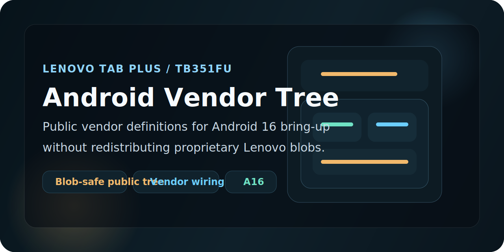

  

# Android Vendor Tree for Lenovo Tab Plus TB351FU

This repository contains the public vendor makefiles and Soong definitions currently used for Lenovo Tab Plus `TB351FU` bring-up.

It is meant to accompany the matching `device`, `kernel`, and recovery work for Android 16 / LineageOS development. To keep the repository safe to share publicly, the actual proprietary blob payload is intentionally **not** included here.

## Important Note

> [!WARNING]
> The `proprietary/` directory is intentionally omitted from this public repository. The makefiles in this tree reference locally extracted blobs that must be generated from stock firmware on your own machine.

That means this repo is a public vendor tree scaffold, not a redistribution of Lenovo proprietary files.

## Status

- Device: Lenovo Tab Plus `TB351FU`
- Bring-up direction: Android 16 / LineageOS
- Repository role: vendor makefiles + Soong import definitions
- Public redistribution policy: no proprietary blobs included
- Intended pairings: `android_device_lenovo_tb351fu` and `android_kernel_lenovo_tb351fu`

## Device Reference

| Item | Value |
| --- | --- |
| Device | Lenovo Tab Plus `TB351FU` |
| Platform family | MediaTek `MT6789` / `MT8781` bring-up target |
| Android base used during current extraction work | Android 16 stock dump reference |
| Vendor structure | `vendor/lenovo/TB351FU` |
| Security layout | AVB-enabled platform, modern partitioned vendor/product/system_ext layout |
| Build purpose | provide vendor-side metadata and package definitions for custom ROM bring-up |

## What This Repository Includes

- [Android.bp](Android.bp): generated Soong import definitions for vendor / product / system_ext packages and libraries
- [Android.mk](Android.mk): vendor-side makefile stub
- [BoardConfigVendor.mk](BoardConfigVendor.mk): generated vendor board config file
- [TB351FU-vendor.mk](TB351FU-vendor.mk): generated product copy rules and package wiring

## What This Repository Does Not Include

- proprietary Lenovo blob files
- stock images
- extracted APK / JAR / `.so` payloads
- anything from `proprietary/`

Those files are referenced by the generated makefiles, but they are intentionally not published here.

## How To Use This Tree

1. Sync the matching device and kernel trees into your Android source checkout.
2. Extract the Lenovo `TB351FU` proprietary blobs locally from a stock dump or firmware source you are allowed to use.
3. Place the extracted blob payload under `vendor/lenovo/TB351FU/proprietary/`.
4. Build with the matching device target once the vendor files exist locally.

If you are using the paired device tree from this project, the usual extraction flow starts from its `extract-files.sh` and `setup-makefiles.sh` tooling.

## Why The Public Repo Still Helps

Even without proprietary payloads, publishing the generated vendor-side structure is still useful for:

- documenting the expected vendor layout
- tracking bring-up changes over time
- reviewing package / copy-rule wiring
- helping other developers understand what still depends on extracted blobs

## Credits

- Lenovo, for the original stock firmware content these definitions are derived from
- The LineageOS project, for the extraction and vendor-generation workflow patterns used here
- Community developers helping map the TB351FU vendor stack into a usable Android 16 bring-up environment

## Related Repositories

- Device tree: <https://github.com/helllopratik/android_device_lenovo_tb351fu>
- Kernel tree: <https://github.com/helllopratik/android_kernel_lenovo_tb351fu>
- Recovery tree: <https://github.com/helllopratik/twrp_device_lenovo_TB351FU>
- TB351FU dev page: <https://helllopratik.github.io/tb351fu/>
