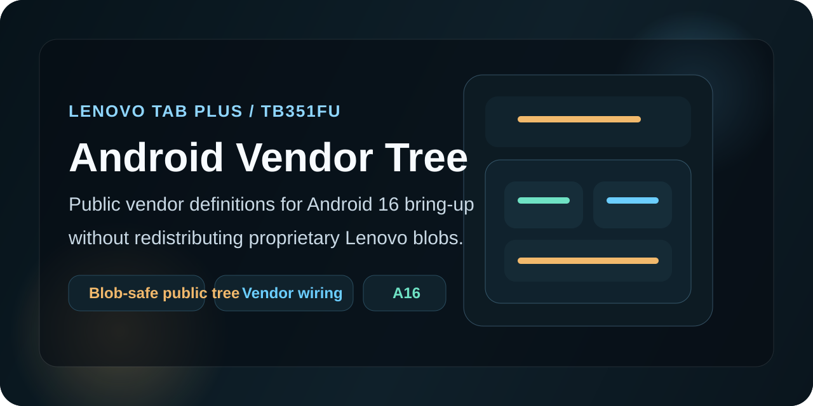

<p align="center">
  
</p>

# Android Vendor Tree for Lenovo Tab Plus TB351FU

This repository contains the vendor makefiles, Soong definitions, and the full proprietary blob payload currently used for Lenovo Tab Plus `TB351FU` bring-up.

It is meant to accompany the matching `device`, `kernel`, and recovery work for Android 16 / LineageOS development. The actual proprietary blob payload is bundled directly under `proprietary/` so the tree builds as-is — **no extraction step is required**.

## Important Note

> [!WARNING]
> This repository includes the proprietary Lenovo blob payload under `proprietary/`. Redistribution should be handled carefully and with respect to applicable licensing and redistribution limits.

## Status

- Device: Lenovo Tab Plus `TB351FU`
- Bring-up direction: Android 16 / LineageOS
- Repository role: vendor makefiles + Soong import definitions + bundled proprietary blobs
- Build flow: fully self-contained — download the vendor, device, and kernel trees and build
- Intended pairings: `android_device_lenovo_tb351fu` and `android_kernel_lenovo_tb351fu`

## Device Reference

| Item | Value |
| --- | --- |
| Device | Lenovo Tab Plus `TB351FU` |
| Platform family | MediaTek `MT6789` / `MT8781` bring-up target |
| Android base used during current extraction work | Android 16 stock dump reference |
| Vendor structure | `vendor/lenovo/TB351FU` |
| Security layout | AVB-enabled platform, modern partitioned vendor/product/system_ext layout |
| Build purpose | provide vendor-side metadata and package definitions for custom ROM bring-up |

## What This Repository Includes

- [Android.bp](Android.bp): generated Soong import definitions for vendor / product / system_ext packages and libraries
- [BoardConfigVendor.mk](BoardConfigVendor.mk): generated vendor board config file
- [TB351FU-vendor.mk](TB351FU-vendor.mk): generated product copy rules and package wiring
- [tb351fu-vendor-blobs.mk](tb351fu-vendor-blobs.mk): `PRODUCT_COPY_FILES` wiring for the bundled `proprietary/` payload (regenerable via `generate_advanced_blobs.py`)
- [proprietary/](proprietary/): the full proprietary blob payload (APK / JAR / `.so` / config files)
- [generate_advanced_blobs.py](generate_advanced_blobs.py): rebuilds `tb351fu-vendor-blobs.mk` from `proprietary/`
- [purge_missing_blobs.py](purge_missing_blobs.py): removes entries whose blob files are missing

## How To Use This Tree

1. Sync this vendor tree plus the matching device and kernel trees into your Android source checkout.
2. `lunch lineage_TB351FU-userdebug`
3. Build — the proprietary payload is already in place under `vendor/lenovo/TB351FU/proprietary/`.

### Re-generating the payload (optional)

The `proprietary/` payload is bundled, so no extraction is required to build. If you want to rebuild it from a stock dump or from a running device, run the device tree's extract flow from `device/lenovo/tb351fu/`:

```bash
# From a running device (stock or custom ROM, adb root required):
./extract-files.sh

# From a local stock system dump:
./extract-files.sh /path/to/system_dump
```

`extract-files.sh` pulls every file in `proprietary-files.txt` into `vendor/lenovo/tb351fu/proprietary/` and then regenerates the vendor-side makefiles. After re-extraction (or manual edits to `proprietary/`), you can refresh the wiring with the helper scripts in this repo:

```bash
# Regenerate tb351fu-vendor-blobs.mk from whatever is inside proprietary/
python3 generate_advanced_blobs.py

# Strip entries from tb351fu-vendor.mk whose source files are missing
python3 purge_missing_blobs.py
```

## Credits

- Lenovo, for the original stock firmware content these definitions are derived from
- The LineageOS project, for the extraction and vendor-generation workflow patterns used here
- Community developers helping map the TB351FU vendor stack into a usable Android 16 bring-up environment

## Related Repositories

- Device tree: <https://github.com/helllopratik/android_device_lenovo_tb351fu>
- Kernel tree: <https://github.com/helllopratik/android_kernel_lenovo_tb351fu>
- Recovery tree: <https://github.com/helllopratik/twrp_device_lenovo_TB351FU>
- TB351FU dev page: <https://helllopratik.github.io/tb351fu/>
